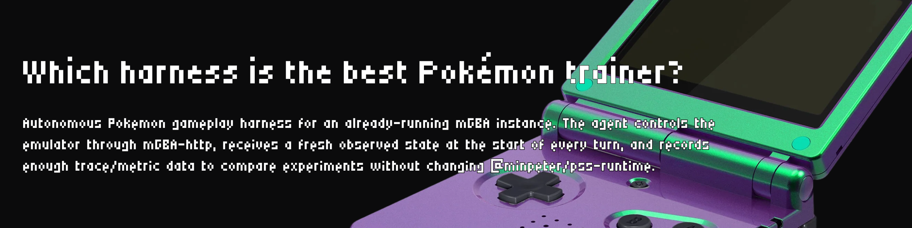

<p align="center">
  
</p>

# 🎮 TypeScript Pokemon Harness

Autonomous Pokemon gameplay harness for an already-running mGBA instance. The
agent controls the emulator through `mGBA-http`, receives a fresh observed state
at the start of every turn, and records enough trace/metric data to compare
experiments without changing `@minpeter/pss-runtime`.

This branch is intentionally local-harness focused: Pokemon RAM reads, movement
supervision, stuck memory, milestone scoring, screenshot processing, and run
metrics all live here unless separate evidence proves a generic runtime need.

## 🧭 Mission

Build a Pokemon Red autonomous-play harness that improves by evidence, not by
guessing. The runner should read the current game state, select only the rules
that apply now, execute a small skill/action, evaluate the trace, and feed
verified improvement hints into later runs.

```text
Rulebook memorization        ❌
Current-state rule reading   ✅

Raw button spam              ❌
Rule -> Skill -> Action      ✅

Vague reflection             ❌
Trace-backed candidate patch ✅
```

The first hard objective is intentionally narrow: reach Viridian City in
Pokemon Red from the early Pallet Town / Route 1 segment. Full-game completion
is treated as staged expansion on top of this foundation.

## 🧱 Architecture At A Glance

```text
┌──────────────────────┐
│ mGBA + Pokemon Red   │
└──────────┬───────────┘
           │ screenshots + RAM
┌──────────▼───────────┐
│ Observation Parser   │
│ vision + RAM state   │
└──────────┬───────────┘
           │ mode, map, x/y, battle, recent actions
┌──────────▼───────────┐
│ Rule Memory Read     │
│ active Stage 1 rules │
└──────────┬───────────┘
           │ recommended skill/action
┌──────────▼───────────┐
│ Skill Executor       │
│ route, dialogue,     │
│ recovery, battle     │
└──────────┬───────────┘
           │ supervised button action
┌──────────▼───────────┐
│ Evaluator + Trace    │
│ progress, loops,     │
│ stuck, token usage   │
└──────────┬───────────┘
           │ evidence
┌──────────▼───────────┐
│ Self-Improvement     │
│ candidate + hints    │
└──────────────────────┘
```

🧠 The harness is not a single LLM pressing buttons forever. The LLM is a
planner/fallback inside a stricter local loop. RAM, screenshots, rules,
supervised controls, trace scoring, and candidate gates are first-class runtime
objects.

## ⚙️ Requirements

- Node.js 20 or newer
- pnpm 11.2.2
- mGBA with the `mGBASocketServer.lua` script
- `mGBA-http`
- A legally obtained Game Boy ROM already loaded in mGBA

Install dependencies:

```bash
pnpm install
```

Copy `.env.example` to `.env` and configure the local emulator and model:

```bash
MGBA_HTTP_BASE_URL=http://127.0.0.1:5000
POKEMON_ROM_PATH=
AI_PROVIDER=openai-compatible
AI_BASE_URL=
AI_API_KEY=
AI_MODEL=
AI_MICRO_MODEL=gpt-5.3-codex-spark
STAGE1_FAST_MOVEMENT_FRAMES=10
STAGE1_FAST_SETTLE_MS=45
METRICS_HTTP_HOST=0.0.0.0
METRICS_HTTP_PORT=9464
```

`AI_PROVIDER` supports model preset switching without code changes:

- `openai-compatible`: defaults `AI_MODEL` to `gpt-5.5` and `AI_MICRO_MODEL` to `gpt-5.3-codex-spark`
- `grok`: defaults `AI_MODEL` to `grok-4.3` and `AI_MICRO_MODEL` to `grok-3-mini-fast`

Always set `AI_BASE_URL` and `AI_API_KEY` in local `.env`; provider endpoint
URLs and keys are intentionally not committed. For Grok model experiments, keep
`AI_PROVIDER=grok` and switch `AI_MODEL` between compatible model ids such as
`grok-4.3`, `grok-4.20-0309-reasoning`,
`grok-4.20-0309-non-reasoning`, `grok-4.20-multi-agent-0309`,
`grok-3-mini`, or `grok-3-mini-fast`.

Use `AI_MICRO_MODEL` for the fast per-action controller. Keep macro planning on
the stronger `AI_MODEL`, but run micro button decisions on a low-latency model
such as `gpt-5.3-codex-spark` or `grok-3-mini-fast`.

Start mGBA and `mGBA-http` separately, then run the harness:

```bash
mkdir -p .pss-mgba/saves
/Applications/mGBA.app/Contents/MacOS/mGBA \
  -C savegamePath=/Users/jinminseong/Desktop/pocketmon-harness/.pss-mgba/saves \
  /absolute/path/to/legal/rom.gb
.local-tools/mgba-http/mGBA-http
pnpm dev
```

If your mGBA build does not support a CLI `--script` flag, open
`Tools > Scripting...` inside mGBA and run:

```lua
dofile("/Users/jinminseong/Desktop/pocketmon-harness/.local-tools/mgba-http/mGBASocketServer.lua")
```

The writable `savegamePath` avoids mGBA's `Failed to open save file` warning
when the ROM is outside a writable experiment directory.

## 🚀 Live Demo Runbook

Use this sequence when demonstrating the current harness locally. Long-running
commands should be started in separate terminals:

```bash
# Terminal 1: emulator
mkdir -p .pss-mgba/saves

/Applications/mGBA.app/Contents/MacOS/mGBA \
  -C savegamePath=/Users/jinminseong/Desktop/pocketmon-harness/.pss-mgba/saves \
  /Users/jinminseong/Downloads/Pokemon\ -\ Red\ Version.gb

# Terminal 2: mGBA HTTP bridge
.local-tools/mgba-http/mGBA-http

# Terminal 3: web dashboard
pnpm viewer

# Terminal 4: terminal observer
pnpm tui

# Terminal 5: Grok gameplay runner
AI_PROVIDER=grok \
AI_MODEL=grok-4.3 \
AI_MICRO_MODEL=grok-3-mini-fast \
MGBA_HTTP_BASE_URL=http://127.0.0.1:5000 \
pnpm dev
```

🔐 Keep `AI_BASE_URL` and `AI_API_KEY` in `.env`. Do not paste secrets into
README, logs, traces, screenshots, or commits.

Reset the current emulator before a clean attempt:

```bash
curl -i -X POST http://127.0.0.1:5000/coreadapter/reset
```

Run the deterministic Stage 1 autopilot when you want a fast non-LLM baseline:

```bash
MGBA_HTTP_BASE_URL=http://127.0.0.1:5000 pnpm stage1:fast
```

The harness expects one live emulator server. Do not start a second mGBA or
`mGBA-http` process for a live experiment; the current emulator state is the
state being measured.

Check all live prerequisites before a run:

```bash
pnpm readiness
```

This probes local model config, ROM path, mGBA HTTP reachability, trace
observer state, dashboard availability, self-improvement status, Ralph status,
and parallel-run configuration without printing secrets.

## 🔁 Runtime Loop

`src/index.ts` creates a persistent `pokemon-run` session and loops forever.
Each turn:

1. Captures mGBA status, screenshot, and Pokemon RAM state when available.
2. Crops Game Boy screenshots to 160x144 and overlays red 16x16 movement guide
   lines for navigation.
3. Injects the observed state, screenshot, recent actions, and stuck-memory
   hints into the model input.
4. Asks the model to emit one `<action_plan>...</action_plan>` block and execute
   exactly one useful game action.
5. Streams runtime events into pretty logs, token traces, behavior metrics, and
   Prometheus output.

There is no CLI prompt, `--loop` flag, max-turn stop condition, or completion
marker. Stop the process with `Ctrl-C` when the experiment window ends.

## 🎛️ Control Plane

The model can use these tools:

- `mgba_tap`
- `mgba_tap_many`
- `mgba_hold`
- `mgba_hold_many`
- `mgba_release`

ROM loading and reset tools are intentionally not exposed. The underlying client
still has helpers for mGBA endpoints, but model-facing tools must not reset,
reload, or restart game progress.

The local supervisor wraps control calls before they reach mGBA. It normalizes
directional movement to one tile, normalizes non-directional taps, rejects unsafe
directional multi-holds, waits for post-action settle frames, and polls through
short black/loading frames before the next observation.

## 👀 Observation And Progress Signals

The harness combines visual and state signals:

- `src/screenshot-image.ts` decodes PNG screenshots, crops mGBA Game Boy frames,
  draws the movement grid, and detects black/loading frames.
- `src/pokemon-state.ts` reads compact Pokemon Red RAM fields such as map,
  position, facing direction, and battle state. If RAM reads fail, the run falls
  back to visual-only observation.
- `src/stuck-memory.ts` records repeated failed movement edges and recent
  recovery attempts so the prompt can avoid blind repetition.
- `src/pokemon-milestones.ts` scores coarse progress milestones such as player
  control reached, first map transition, and battle detected/completed.

The current RAM map is Pokemon Red oriented. Do not interpret those state fields
as authoritative for another ROM unless separate validation proves they match.

## 📈 Metrics And Traces

Each run creates a trace directory under `.pss-mgba/traces/runs/<run-id>/` and
appends an iteration record to `.pss-mgba/traces/iterations.jsonl`.

Important outputs:

- `run.json`: run metadata, mode, experiment id, milestone, stuck count, and
  supervisor count.
- `events.jsonl`: structured viewer event log with observation screenshots and
  status, `action_plan` summaries, action tool calls and results, and supervisor
  interventions.
- `token-usage.jsonl`: per-step and per-turn token usage.
- Prometheus endpoint: `http://127.0.0.1:9464/metrics` by default.
- `pnpm trace:report`: local comparison report across recorded iterations.

Behavior metrics include action entropy, A-button ratio, same-action streaks,
visual novelty, observe-before-act ratio, tool error rate, turn/step/tool
durations, stuck events, and supervisor interventions. Token savings only count
as improvement when progress, stuck behavior, action diversity, and tool
reliability do not regress.

## 🖥️ Trace Viewer

New runs write `events.jsonl` automatically. Build the React viewer with
`pnpm web:build`, then serve the built viewer and local API with `pnpm viewer`.
The default viewer URL is `http://127.0.0.1:9474`.

During UI development, run `pnpm viewer` for the local API and `pnpm web:dev`
for Vite. Vite proxies `/api` requests to the viewer server. Older runs without
`events.jsonl` still show metadata and token metrics, but they do not have
screenshots or an action timeline. No deployment or API keys are required, and
the server is local-only by default.

## 🧾 Terminal Observer

Use the read-only terminal dashboard while a run is active:

```bash
pnpm tui
```

For a single snapshot:

```bash
pnpm tui -- --once
```

The TUI reads the latest trace under `.pss-mgba/traces/runs/` and shows macro
progress phase, health, confidence, gaps, run id, milestone, model, action
count, supervisor interventions, token usage, and the latest action/reasoning
without touching mGBA or the model process. See
`pokemon-red-macro-progress-observer.seed.yaml` for the macro progress model and
`docs/ouroboros-ralph-readiness.md` for the Ouroboros/Ralph completion and gap
audit.

## 🧬 Self-Improvement And Parallel Runs

🧠 The harness follows the project architecture from the seed:

```text
Observation(RAM + screenshot)
  -> Mode / progress inference
  -> Rule Memory Read
  -> Skill / pathfinder selection
  -> supervised mGBA action
  -> evaluator / trace evidence
  -> self-improvement candidate
  -> next-run improvement hint
```

🎮 Runtime policy:

- Micro gameplay actions run on the low-latency `AI_MICRO_MODEL`.
- For Grok runs, use `AI_PROVIDER=grok`, `AI_MODEL=grok-4.3`, and
  `AI_MICRO_MODEL=grok-3-mini-fast`.
- Codex is not required for live gameplay decisions; it is only used for code
  edits and local orchestration in this workspace.
- The model never receives reset/reload tools. Emulator lifecycle remains
  outside the model-facing control plane.

🧭 Stage 1 route policy:

- The first hard objective is reaching Viridian City in Pokemon Red.
- RAM state is used for `mapId`, player coordinates, facing, and battle state.
- Screenshots remain attached so the model can recover when RAM mode detection
  is ambiguous.
- Dijkstra/backtracking route planning is used for the Pallet Town / Route 1
  path, and repeated failed edges are blocked after 3 attempts.

Generate a QA-gated improvement candidate from the latest trace:

```bash
pnpm improve:trace
```

The command reads `events.jsonl`, evaluates repeated-action and no-progress
state evidence, suppresses progressing dialogue, and writes
`.pss-mgba/improvements/<run-id>.candidate.json` only when evidence supports a
candidate. It does not silently promote candidates into active rules.

🔁 Run the self-improvement watcher beside a live Grok run:

```bash
SELF_IMPROVEMENT_WATCH_INTERVAL_MS=15000 pnpm improve:watch
```

The watcher repeatedly evaluates the latest trace and writes candidate evidence
when the run stalls. New candidates are injected into later observations as
self-improvement hints, so the next Grok action loop can adapt without exposing
API secrets.

📊 Watch progress while the loop runs:

```bash
pnpm viewer
pnpm tui
```

- Web dashboard: `http://127.0.0.1:9474`
- TUI: macro phase, health, confidence, gaps, latest action, model id, token
  usage, and supervisor interventions.
- Trace files: `.pss-mgba/traces/runs/<run-id>/events.jsonl`

Run multiple live harness instances when multiple mGBA HTTP servers are already
running:

```bash
POKEMON_PARALLEL_MGBA_PORTS=5001,5002 pnpm parallel:run
```

Each instance receives a separate `MGBA_HTTP_BASE_URL` and experiment label.
This is real process orchestration, not replay simulation; every listed port
must point to a running mGBA + `mGBA-http` pair.

⚠️ Current parallel boundary:

- One live mGBA + `mGBA-http` pair is currently running on this machine.
- `parallel:run` can orchestrate multiple harness processes only after separate
  emulator/Lua socket pairs are available on separate ports.
- Until then, the maximum safe parallelism is one live Grok gameplay run plus
  concurrent viewer, TUI, trace evaluator, and self-improvement watcher.

## ✅ Methodology Coverage

| User-planned method | Current implementation |
| --- | --- |
| 🎮 Pokemon Red only | Runtime state and Stage 1 rules are scoped to Pokemon Red RAM identity. |
| 📖 Rule Memory / Game Manual / Skill Library | `src/stage1-memory.ts`, active rules, active skills, route knowledge, and runtime Rule Memory Read injection. |
| 🧠 Rule -> Skill -> Action loop | Each observation includes recommended rules, skill, and action before model fallback. |
| 👀 RAM + vision observation | RAM parser reads map/x/y/facing/battle; screenshot pipeline crops and overlays movement grid. |
| 🔁 3+ repeated loop evidence | Self-improvement evaluator detects repeated action and no-progress state loops before emitting candidates. |
| 🧪 Evaluator before promotion | `pnpm improve:trace` writes candidate JSON only; it does not auto-mutate active rules. |
| 🧭 Dijkstra/backtracking | Stage 1 pathfinder plans Pallet Town / Route 1 route and blocks failed edges. |
| ⚡ Fast micro actions | `AI_MICRO_MODEL` separates fast controller model from stronger macro model. |
| 🤖 Grok gameplay mode | `AI_PROVIDER=grok` switches defaults to `grok-4.3` / `grok-3-mini-fast`. |
| 📊 Observer dashboard | Web viewer, TUI, Prometheus, and optional Grafana show trace, macro progress, and health. |
| 🧵 Parallel hypotheses | `parallel:run` can launch multiple harness processes when each has its own mGBA HTTP port. |
| 🧑 Human intervention | The model cannot reset/reload ROM; humans can reset or stop/restart processes externally. |
| 🐍 Ouroboros/Ralph process | Formal local evaluate/Ralph artifacts are documented in `docs/`; live Ralph MCP is gated on missing MCP tools. |

## 🚧 Current Gaps And Boundaries

These are intentionally documented so the README does not overclaim:

- 🕹️ True multi-emulator parallel gameplay requires multiple independent
  mGBA + Lua socket + `mGBA-http` pairs, each on its own port.
- 🧪 Candidate patches are not automatically promoted into active rules; this is
  a safety boundary until QA gates are stronger.
- 🗺️ The implemented route knowledge is Stage 1 only, not a full Pokemon Red
  world graph.
- 🥊 Battle policy is basic; full Gen 1 type matchups, team building, HM
  planning, and Elite Four strategy remain staged future work.
- 🐍 Ralph MCP execution cannot be started unless the Ouroboros MCP exposes
  `ouroboros_ralph` and related job tools in the active Codex session.

## 📊 Grafana

Start the local observability stack:

```bash
docker compose -f docker-compose.grafana.yml up -d
```

Then run the harness normally:

```bash
pnpm dev
```

Prometheus scrapes the harness through `host.docker.internal:9464`, and Grafana
provisions the `pss-mgba Run Iterations` dashboard at
`http://127.0.0.1:3000`. Keep the stack running during experiments so each new
`run_id` and iteration remains visible as a separate time series.

## ✅ Verification

Run the full guardrail before accepting changes or experiment evidence:

```bash
pnpm typecheck && pnpm test && pnpm build && pnpm check
```

Useful focused commands while iterating:

```bash
pnpm test -- tests/mgba-http.test.ts tests/runner.test.ts tests/observation.test.ts
pnpm test -- tests/screenshot-image.test.ts tests/run-metrics.test.ts tests/metrics-server.test.ts
pnpm test -- tests/viewer-events.test.ts tests/viewer-server.test.ts
pnpm web:typecheck
pnpm web:build
pnpm trace:report
```

Connectivity probe before a live run:

```bash
python3 - <<'PY'
import urllib.request
for path in ['/core/currentframe','/core/getgamecode','/core/getgametitle','/mgba-http/button/getall']:
    with urllib.request.urlopen('http://127.0.0.1:5000'+path, timeout=2) as response:
        print(path, response.status, response.read(200).decode('utf-8','replace'))
PY
```

Five-minute experiment window:

```bash
MGBA_HTTP_BASE_URL=http://127.0.0.1:5000 pnpm dev > .omo/evidence/<task>-pnpm-dev.log 2>&1 & PID=$!; sleep 300; kill -INT $PID; wait $PID || true
```

Valid run modes are `fresh`, `resumed`, `recovery`, `deterministic-replay`, and
`exploratory`. Use `fresh` only for a normal run from the current live emulator
state. Recovery and deterministic replay metrics must not be mixed with fresh
progress metrics.

## ⚠️ Evidence Caveats

Keep evidence tied to run id and ROM identity.

- Baseline Task 1 run `00058-2026-05-24T06-19-02-489Z` used Pokemon Red identity
  `DMG-AR` / `PKMN RED ST`, with 29 summarized turns, `1,189,899` total tokens,
  and `41,031.0` average tokens per turn.
- Combined Task 8 run `00064-2026-05-24T07-51-35-549Z` was metadata-valid with
  `mode=fresh`, `experimentId=combined-optimized`, 20 summarized turns,
  `607,453` total tokens, `30,372.7` average tokens per turn, `stuckEvents=0`,
  `supervisorInterventions=24`, and milestone `player-control-reached`.
- Do not claim this proves a clean Pokemon Red gameplay improvement: Task 8 used
  Pokemon Gold identity `DMG-AAUE` / `POKEMON_GLD`, not the baseline Pokemon Red
  identity.

Reject or roll back an improvement when token usage improves but progress,
stuck behavior, action entropy, tool reliability, or ROM identity gets worse.

## 🧩 Runtime Boundary

Task 9 recorded `NO_RUNTIME_CHANGE` in `.omo/evidence/task-9-runtime-gate.md`.
That remains the default boundary: do not move harness-specific behavior into
`@minpeter/pss-runtime` without separate cross-harness evidence.

Exception: PR 39 updates this harness to published `@minpeter/pss-runtime@0.0.8`
to use the released `toolChoice` and `session.steer(...)` APIs. The implementation
stays local to this repository: the runtime package source is not modified, and
after-step screenshots are steered into the active session before the next model
step.

Only move work into `@minpeter/pss-runtime` after multiple runs prove the same
need outside this Pokemon/mGBA harness and the evidence names the affected
runtime loop, session, event, budget, metric, store, or replay contract.
